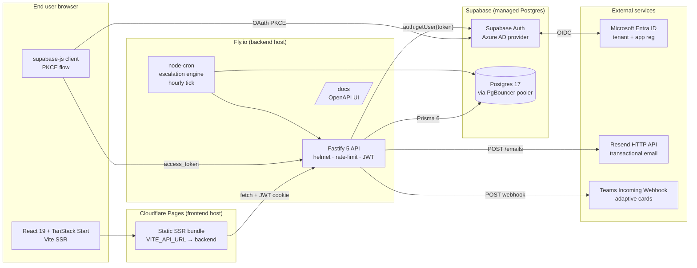
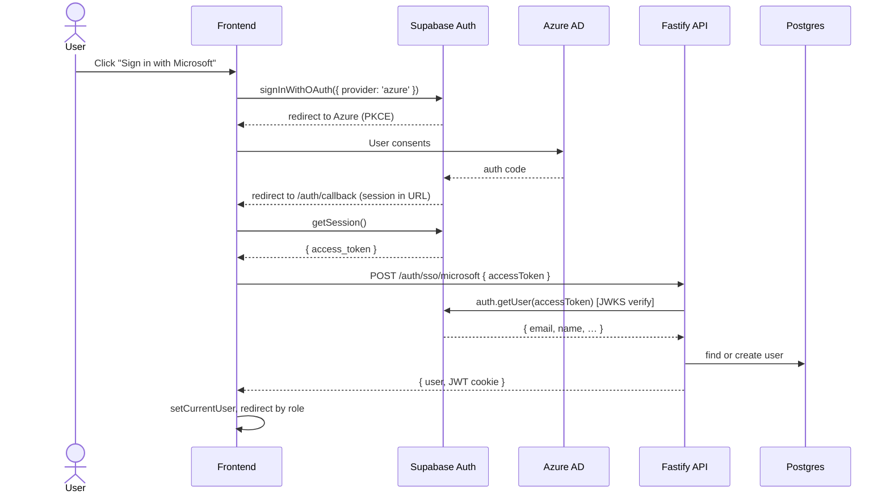

# GoalFlow — Architecture

## System Overview

## Component responsibilities

| Component | Responsibility | Path |
|---|---|---|
| **React frontend** | UI state, React Query for server cache, role-gated routes | `goalflow-atomberg-hub/src/` |
| **Fastify API** | Business logic, auth, validation, audit, exports, analytics | `goalflow-backend/src/routes/` |
| **Prisma layer** | Schema + typed queries against Supabase Postgres | `goalflow-backend/prisma/` |
| **`node-cron`** | Hourly escalation tick — evaluates rules, raises events, notifies | `goalflow-backend/src/services/escalation.service.ts` |
| **Supabase Auth** | OAuth dance with Azure AD; issues short-lived JWT for token-exchange | (managed) |
| **Supabase Postgres** | Single source of truth — all 8 BRD entities | (managed) |
| **Resend** | Transactional email — submitted / approved / returned / check-in reminder | `goalflow-backend/src/lib/email.ts` |
| **Teams webhook** | Adaptive cards with FactSet + contextual color bar | `goalflow-backend/src/lib/teams.ts` |

## Auth flow (real Entra ID SSO)

The mock email-only path is preserved at the same endpoint for offline demos / smoke tests.

## Data model

8 entities, all in `goalflow-backend/prisma/schema.prisma`:

| Entity | Purpose |
|---|---|
| `User` | 3 roles, manager linkage for hierarchy |
| `Cycle` | Goal Setting + Q1–Q4 windows with `openDate` / `closeDate` |
| `Goal` | Owner-scoped + cross-cycle. Flags for `locked`, `isSharedPrimary`, `isSharedClone`, `sharedPrimaryId` |
| `QuarterUpdate` | Per-quarter actual + status + note. Unique on (`goalId`, `quarter`) |
| `AuditEntry` | All mutations. `postLock` flag = BRD §4 governance requirement |
| `Notification` | In-app notifications fanned from notify() service |
| `EscalationRule` | Configurable: `GOAL_NOT_SUBMITTED`, `APPROVAL_PENDING`, `CHECKIN_INCOMPLETE` |
| `EscalationEvent` | History of raised escalations with level 1/2/3 |

## Deployment topology (when deployed)

- **Frontend** → Cloudflare Pages (free, global CDN)
- **Backend** → Fly.io free machine in `bom` (Mumbai) — same region cluster as Supabase
- **Database** → Supabase ap-northeast-2 (Seoul); pooler at `aws-1-ap-northeast-2.pooler.supabase.com:6543`
- **Cron** → in-process `node-cron` on Fly (since `auto_stop_machines = false`); fallback path is Supabase `pg_cron` calling `POST /escalation/tick`

Estimated monthly cost: **$0** within free tiers for hackathon-grade traffic.

## Source diagram

The above diagram is editable as Mermaid in this file. For a static PNG suitable for slides, export from any Mermaid-compatible tool (e.g. <https://mermaid.live>). An `architecture.png` should accompany this file for the README image link.
